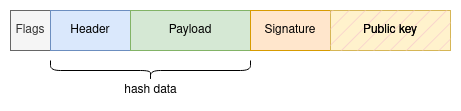

## Abstract

This document proposes removing the PublicKey from transactions if it is already known.

## Motivation

Removing known public keys from transactions could reduce the size of the blockchain.

## Specification

To be able to reconstruct a transaction from the raw data, a new field named `Flags` will be added to the transaction that indicates whether the public key is excluded from the committed transaction and can be fetched from the database if needed. If the first bit of the `Flags` is set to `1`, this indicates that the public key is known and excluded from the transaction.

Once a transaction is committed for the first time, its public key can be indexed by the associated address. If the same signer broadcasts another transaction, the public key can be safely removed from the transaction, as it is already known and indexed by the signer's address.

### Transaction ID

The `Flags` field will be excluded from the hash data in order to maintain the integrity of the transaction data. The hash will only include the Header and Payload data.

## Security Considerations

The proposed change has security implications that need to be considered. 

One primary security consideration is the potential for a malicious actor to manipulate the Flags field. If an attacker is able to modify the value of the Flags field, they could remove the public key from a transaction and subsequently alter the transaction. Additionally, if the public key is removed from the transaction and a transaction is broadcast from a different address with the same signature, it may cause confusion and lead to double-spending attacks. This can be mitigated by adding a cryptographic signature to the Flags field, ensuring that it cannot be modified by anyone other than the owner of the private key.

Another potential security issue is the possibility of a signer’s public key being compromised. If a public key is compromised, all transactions associated with that public key become susceptible to replay attacks. As the proposed change relies on indexing public keys by address, an attacker with access to a signer's address would be able to replay transactions associated with the compromised public key. To mitigate this risk, it is recommended to ensure that the private key used for signing transactions is kept secure. Additionally, regular updates of cryptographic algorithms and stronger key sizes can help to prevent vulnerabilities in the hashing process.

Overall, the proposed change has the potential to enhance the efficiency and performance of the Pactus blockchain. However, careful consideration and implementation of security measures are necessary to ensure that it does not introduce vulnerabilities or create opportunities for malicious actors.

## Copyright

Copyright and related rights waived via [CC0](../LICENSE.md).
