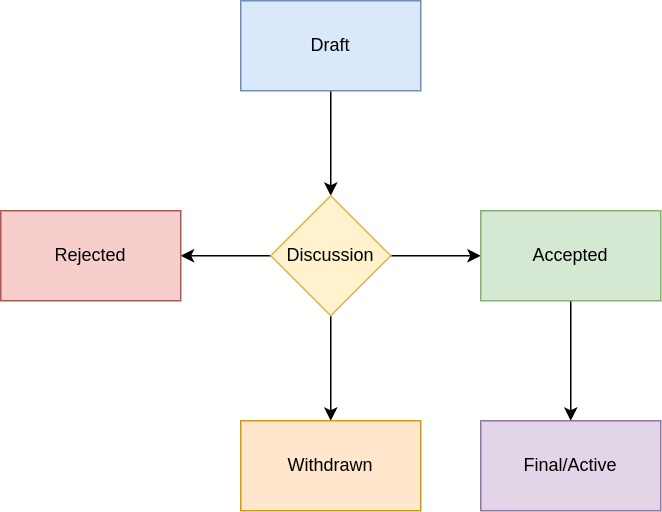

## What is an PIP?

Pactus Improvement Proposals (PIPs) serve as a comprehensive framework for outlining and defining the standards 
for the Pactus platform's ongoing development and enhancement. These proposals cover various aspects of the platform, 
including core protocol specifications and client application programming interfaces (APIs). By establishing a clear 
and consistent set of guidelines, PIPs ensure seamless interoperability and extensibility across the Pactus ecosystem, 
fostering a robust and efficient environment for developers and users alike.

## PIP Rationale

We intend PIPs to be the primary mechanisms for proposing new features, for collecting community technical input on an issue, and for documenting the design decisions that have gone into Pactus. Because the PIPs are maintained as text files in a versioned repository, their revision history is the historical record of the feature proposal.

For Pactus implementers, PIPs are a convenient way to track the progress of their implementation. Ideally, each implementation maintainer would list the PIPs that they have implemented. This will give end users a convenient way to know the current status of a given implementation or library.

## PIP Types

There are three types of PIP:

Standards Track PIP: Describes any change that affects most or all Pactus implementations, such as—a change to the network protocol, a change in block or transaction validity rules, proposed application standards/conventions, or any change or addition that affects the interoperability of applications using Pactus. Standards Track PIPs consist of three parts—a design document, an implementation, and (if warranted) an update to the formal specification. Furthermore, Standards Track PIPs can be broken down into the following categories:

Core: Improvements requiring a consensus fork, as well as changes that are not necessarily consensus critical but may be relevant to "core dev" discussions.
Networking: Includes improvements around devp2p and Light Pactus Subprotocol, as well as proposed improvements to network protocol specifications of whisper and swarm.
Interface: Includes improvements around client API/RPC specifications and standards. The label "interface" aligns with the interfaces repo, and discussion should primarily occur in that repository before a PIP is submitted to the PIPs repository.
PRC: Application-level standards and conventions, including contract standards such as token standards, name registries, URI schemes, library/package formats, and wallet formats.
Meta PIP: Describes a process surrounding Pactus or proposes a change to (or an event in) a process. Process PIPs are like Standards Track PIPs but apply to areas other than the Pactus protocol itself. They may propose an implementation, but not to Pactus's codebase; they often require community consensus; unlike Informational PIPs, they are more than recommendations, and users are typically not free to ignore them. Examples include procedures, guidelines, changes to the decision-making process, and changes to the tools or environment used in Pactus development. Any meta-PIP is also considered a Process PIP.

Informational PIP: Describes a Pactus design issue, or provides general guidelines or information to the Pactus community, but does not propose a new feature. Informational PIPs do not necessarily represent Pactus community consensus or a recommendation, so users and implementers are free to ignore Informational PIPs or follow their advice.

It is highly recommended that a single PIP contain a single key proposal or new idea. The more focused the PIP, the more successful it tends to be. A change to one client doesn't require a PIP; a change that affects multiple clients, or defines a standard for multiple apps to use, does.

A PIP must meet certain minimum criteria. It must be a clear and complete description of the proposed enhancement. The enhancement must represent a net improvement. The proposed implementation, if applicable, must be solid and must not complicate the protocol unduly.

## PIP Status Terms

- Draft - Proposal under active discussion and revision.
- Accepted - Normative proposal accepted for implementation.
- Final - Accepted and implementation complete, or no longer active.
- Rejected - Formally declined and will not be accepted.
- Withdrawn - Removed from consideration by sponsor or authors.