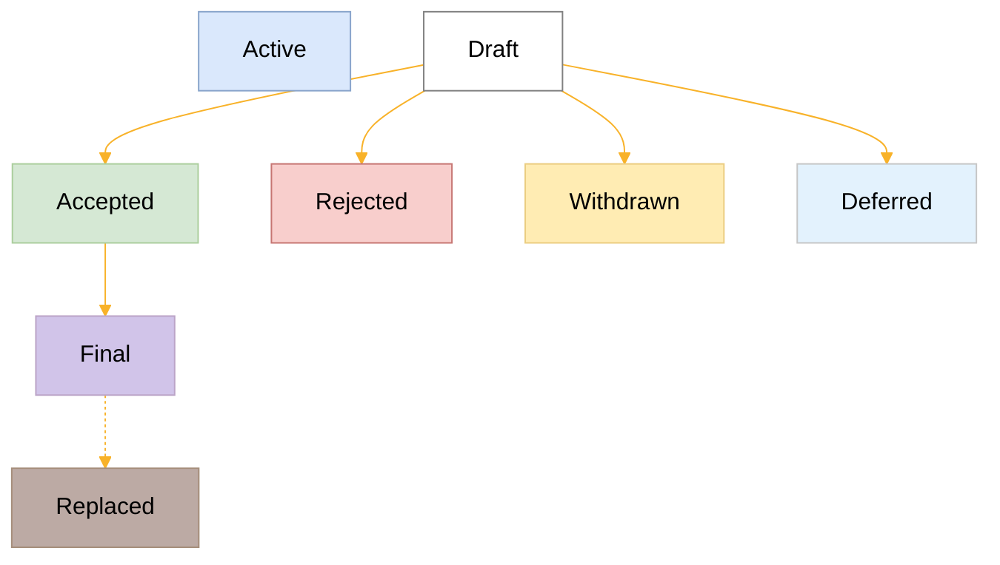

## What is a PIP?

A Pactus Improvement Proposal, or PIP, is a design document that provides information or
describes a new feature for the Pactus blockchain.
The primary goal of a PIP is to encourage the development team to write down ideas before implementation and
invite the community to contribute more efficiently.
It also helps to brainstorm, review, and discuss changes and potential issues before
they can impact the production environment.

## PIP workflow

The PIP process starts with an idea for the Pactus blockchain.
The author should document the idea in PIP format and explain it in simple and
[plain English](https://plainenglish.co.uk/how-to-write-in-plain-english.html).
The drafted PIP can then be submitted to the PIP repository.

The PIP should be assigned a proper number and category before it gets merged.
Once the PIP is merged into the repository,
a [discussion](https://github.com/pactus-project/PIPs/discussions) page will be created for it.
All discussions around the PIP will be conducted on this discussion page.

Authors can update drafts as needed through pull requests until the PIP is approved.
Once a PIP is approved, the implementation of the PIP can begin.

## PIP Status

The typical paths of the status of PIPs are as follows:

- **Draft**: The PIP is in the initial stage and is being actively worked on.
  It is open for feedback and suggestions from the community.

- **Accepted**: The PIP has been reviewed and accepted for implementation.
  It indicates that the idea has been thoroughly discussed and is ready to be worked on by developers.

- **Final**: The PIP has been fully implemented and is now part of the Pactus protocol.
  It indicates that the changes proposed in the PIP are live and operational.

- **Replaced**: The PIP has been replaced by a newer PIP.
  This typically happens when the proposed changes are superseded by a more effective or updated solution.

- **Deferred**: The PIP is on hold and not currently being considered for implementation.
  It may be revisited in the future based on community needs and priorities.

- **Withdrawn**: The PIP has been withdrawn by the author.
  This can occur if the author decides not to pursue the idea.

- **Rejected**: The PIP has been reviewed and rejected.
  This status indicates that the proposed changes are not suitable for implementation within the Pactus protocol.

- **Active**: The PIP is continually being updated and has not reached a state of finality.
  This status is typically reserved for documents that require ongoing updates and revisions,
  such as this document, PIP-1.

## PIP Formats and Templates

PIPs should be written in [Markdown](https://www.markdownguide.org/cheat-sheet/) format.
A [template](https://github.com/pactus-project/PIPs/blob/main/pip-template.md) is provided,
containing inline comments that briefly explain each field.
Please follow these comments and complete the PIP accordingly.

## PIP Types

There are types of a PIP:

### Standards Track

Standards Track PIPs propose changes to the Pactus blockchain's protocols,
including improvements to the core protocol, network, or any other standards.

### Informational

Informational PIPs describe Pactus design issues, guidelines, or general information
that is not suitable for the Standards Track.
They may also propose features or ideas for further discussion within the community.

### Process

Process PIPs propose changes to the PIP process itself or suggest improvements to
the decision-making process within the Pactus community.

## PIP Categories

Standards PIPs are categorized into the following layers:

### Core

Core PIPs propose changes to the fundamental aspects of the Pactus protocol.
These changes are critical and require careful consideration due to their potential impact on the entire network.

### Network

Network PIPs focus on changes related to network communication.
This includes improvements to the peer-to-peer protocol, network topology, and related networking functionalities.

### Interface

Interface PIPs propose changes to the external interfaces of the Pactus protocol, such as APIs.
These changes impact how developers interact with the Pactus blockchain.

### Wallet

Wallet PIPs propose changes to the Pactus native wallet, including
updates to the cryptographic signature scheme, HD wallet improvements, and related features.
