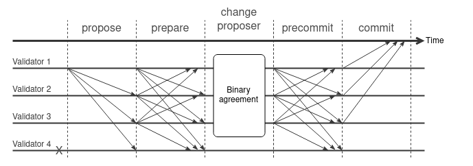

## Abstract

This proposal suggests an enhancement in the consensus protocol in which
any non-faulty validator can commit a block upon receiving $$3f+1$ valid $\text{PREPARE}$messages.

Figure below shows the overview of the protocol.

## Motivation

In practical scenarios, most validators in the network function correctly.
However, occasional network delays can affect the timely receipt of messages.
If a validator receives sufficient valid $\text{PREPARE}$ messages (specifically $3f+1$ of them in a timely manner,
it can commit the proposed block during the Prepare step.

This fast agreement path potentially decreases the number of network messages by approximately 50% and
the block finalization time by about 30%, eliminating the need for the $\text{PRECOMMIT}$ step
and broadcasting for $(n-1)^2$ messages in the Precommit phase.

## Specification

In each height, the consensus protocol is executed by $3f+1$ validators, and execution is organized into a sequence of rounds.
Within a round, a single validator is designated as the proposer responsible for collecting transactions and creating a proposal block.
The proposer then broadcasts a proposal message that includes the proposal block to other validators.
Other validators, once they receive the proposal message, validate it and broadcast the $PREPARE$ message to other validators.

### Fast Agreement Path

In the fast agreement path, once a validator receives $3f+1$ $PREPARE$ messages from other validators including itself,
it commits the block, clears its message log, and moves to the next height.

Figure below shows the communication patterns for the fast agreement path.

### Change Proposer Path

If the network, proposer, or some validators are faulty faults,
the validators might not receive responses from all $3f+1$ validators, causing them to become stuck.
The change-proposer phase is triggered by timeouts and prevent validators from waiting indefinitely for the proposal to committed.

The change-proposer phase is a binary agreement, and each validator begins with an initial value $v_i \in \\{0,1\\}$
that is biased toward zero.
If a correct validator has received more than $2f+1$ Prepared messages,
the initial value should be set to zero; otherwise, it should be set to one.
The outcome of the binary agreement determines whether the proposer should be changed or not.
If the validators agree to not change the proposer, they continue the agreement protocol by moving to the precommit step.
Otherwise, they increase the round number, and the next proposer proposes the new proposal.

Figure below shows the communication patterns for the agreement path when one validator is faulty.

Figure below shows the communication patterns for the agreement path when the proposer is faulty.

## References:

1. [Zyzzyva: Speculative Byzantine Fault Tolerance](https://www.cs.cornell.edu/lorenzo/papers/kotla07Zyzzyva.pdf)
2. [Bosco: One-Step Byzantine Asynchronous Consensus](https://link.springer.com/chapter/10.1007/978-3-540-87779-0_30)
