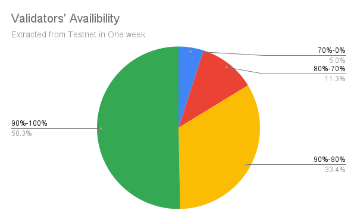

## Abstract

This proposal suggests the introduction of an Availability Score for validators
in the Pactus network to enhance network stability.

## Motivation

Some users are running Pactus on extremely low-spec machines, potentially compromising the stability of the blockchain.
For example, at the time of writing this proposal,
only 50% of validators have signed more than 90% of blocks in a one-week period.
Considering that validators have a 10-second window to validate the block and broadcast their votes,
this level of performance is suboptimal
Therefore, we need to take action to discourage users from dedicating very low-spec machines to run Pactus.

The chart below is extracted from the Testnet data over a one-week period:

This proposal recommends implementing an Availability Score System that evaluates validators
based on their performance within the committee.

## Specification

### Availability Score Calculation

Each validator gives a score to other validators called the "Availability score."
To calculate this score, we look at the last 60,000 blocks, which covers almost a week (each block taking 10 seconds).

To calculate the score, we look at how many blocks a validator signed compared to how many times they were in the committee:

$$
S_i = \frac{V_i}{N_i}
$$

In this formula:

- $S_i$ is the score for validator $i$.
- $V_i$ is how many blocks validator $i$ signed.
- $N_i$ is how many times validator $i$ was in the committee.

The score is a number between 0 and 1.
If a validator wasn't in the committee for the last 60,000 blocks, their score defaults to 1.

### Penalties

When a validator within the committee receives a proposal from another validator,
it first checks the availability score of the proposer.
If the availability score is less than $0.9$, it rejects the proposal and
enters the proposer-change phase [^1].
Since the majority of validators make the same decision, the proposal will be rejected,
and the validator won't receive any reward.

## References

[^1]: [Pactus consensus protocol](https://pactus.org/learn/consensus/protocol/)
