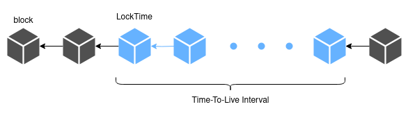

## Abstract

This document proposes to add a `LockTime` field to the Pactus transaction structure to
support scheduled or lock-time transactions.
The `LockTime` field specifies the block number at which the transaction can be unlocked.

## Motivation

Scheduled transactions are a type of transaction set to be executed in the future.
They are commonly referred to as "lock-time" transactions.
The current transaction structure in Pactus does not provide support for such scheduled transactions.

## Specification

To support lock-time transactions, a new field is added to the transaction structure: `LockTime`.

By introducing the `LockTime` field, users can specify a block number at which a
lock-time transaction can be unlocked and executed.
Since each block is created every 10 seconds, users can schedule when their transactions will be executed in the future.
This field is similar to `nLockTime` [^1] in Bitcoin.
However, in Pactus, it is mandatory for all transactions, and it only accepts block numbers as input.

### Time-to-Live Interval

In addition to the `LockTime`, transactions in Pactus have a "Time-to-Live Interval"[^2],
which is the number of blocks that a transaction may remain unprocessed in the transaction pool before being discarded.
Currently, this interval is set to 8640 blocks, equating to approximately one day.

## References

[^1]: [Bitcoin transaction format](https://en.bitcoin.it/wiki/Protocol_documentation#tx)
[^2]: [Pactus consensus parameters](https://pactus.org/learn/consensus/parameters/)
