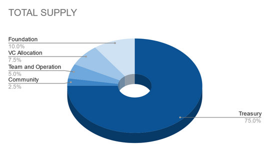

## Abstract

This document suggests reallocating the held reserve back to the treasury account, incorporating a reserve 
fund into the block rewards system, and revising the coin allocation to better benefit the community.

## Motivation

Pactus is currently responsible for holding the reserve funds for the project. However, due to limitations 
within Pactus core functionality and the absence of smart contracts, we are unable to establish an effective
time-locking or vesting schedule. As a result, the coins in these reserves are treated as unlocked, which 
could raise concerns about their potential negative impact on both the project and its investors if they 
were to be introduced to the market. By adopting this proposal, we can gradually release the reserve funds
into the supply, thereby empowering the community and reinforcing trust among our investors.

## Specification

Several actions need to take place for the implementation of this PIP.

  1. Reallocation of reserve funds back to the treasury account.
  2. Revisal of block rewards and recipients.
  3. Coin allocation revisal.
     

### Reserve Wallets

The team currently holds 4 reserve and 2 hot wallets, they are described below with balances.

Reserve:
  1. Foundation - Address - pc1z2r0fmu8sg2ffa0tgrr08gnefcxl2kq7wvquf8z - Balance = 8,400,000.194910010
  2. VC Funds - Address - pc1zprhnvcsy3pthekdcu28cw8muw4f432hkwgfasv - Balance = 6,300,000.000010001
  3. Team & Operations - Address - pc1znn2qxsugfrt7j4608zvtnxf8dnz8skrxguyf45 - Balance = 3,779,999.999010000
  4. Community - Address - pc1zs64vdggjcshumjwzaskhfn0j9gfpkvche3kxd3 - Balance = 1,889,999.999010000

The complete balance of the reserve wallets should be transferred to the treasury account.

Hot: Recieved 640,000 from reserves
  1. Team & Operations - Address - pc1zuavu4sjcxcx9zsl8rlwwx0amnl94sp0el3u37g - Balance 155,999.857000000
  2. Community - Address - pc1zf0gyc4kxlfsvu64pheqzmk8r9eyzxqvxlk6s6t - Balance 5998.971900000

The complete balance of the hot wallets should remain in teams custody for immediate operational funds.

### Validator Considerations

This proposal should not affect validators in any way, they will continue to receive 1 coin per block as a reward.

### Block Rewards 

Block rewards are to increase from 1 coin per block to a rate 1.25 coins per block. 1 coin to be sent to the block proposer
and the remaining 0.25 to be divided among the reserve wallets.

### Block Rewards Allocation

Block rewards of 1.25 are to be allocated as below:

Proposer = 1
Foundation = 0.1
VC Funds = 0.075
Team & Operation = 0.05
Community = 0.025

### Coin Allocation Revision

The revision to the coin allocation we be as follows:

Validators = 31,500,500
Foundation = 4,200,000
VC Allocation = 3,150,000
Team & Operations = 2,100,000 (420,000 already recieved to hot wallet 1) (1,680,000 remains from treasury)
Community = 1,050,000 (210,000 already recieved to hot wallet 2) (840,000 remains from treasury)

Changes will not be made to the total supply, only the allocation.

## Backwards Compatibility

<!--

  This section is optional.

  All PIPs that introduce backwards incompatibilities must include a section describing these incompatibilities and their severity.
  The PIP must explain how the author proposes to deal with these incompatibilities.
  PIP submissions without a sufficient backwards compatibility treatise may be rejected outright.

  The current placeholder is acceptable for a draft.

  TODO: Remove this comment before submitting
-->

No backward compatibility issues found.

## Test Cases

<!--
  This section is optional.

  The Test Cases section should include expected input/output pairs, but may include a succinct set of executable tests.
  It should not include project build files.
  No new requirements may be be introduced here (meaning an implementation following only the Specification section should pass all tests here.)
  If the test suite is too large to reasonably be included inline, then consider adding it as one or more files in `../assets/pip-####/`.
  External links will not be allowed

  TODO: Remove this comment before submitting
-->

## Reference Implementation

<!--
  This section is optional.

  The Reference Implementation section should include a minimal implementation that assists in understanding or implementing this specification.
  It should not include project build files.
  The reference implementation is not a replacement for the Specification section, and the proposal should still be understandable without it.
  If the reference implementation is too large to reasonably be included inline, then consider adding it as one or more files in `../assets/pip-####/`. External links will not be allowed.

  TODO: Remove this comment before submitting
-->

## Security Considerations

<!--
  All PIPs must contain a section that discusses the security implications/considerations relevant to the proposed change.
  Include information that might be important for security discussions, surfaces risks and can be used throughout the life cycle of the proposal.
  For example, include security-relevant design decisions, concerns, important discussions, implementation-specific guidance and pitfalls, an outline of threats and risks and how they are being addressed.
  PIP submissions missing the "Security Considerations" section will be rejected.
  A PIP cannot proceed to status "Final" without a Security Considerations discussion deemed sufficient by the reviewers.

  The current placeholder is acceptable for a draft.
