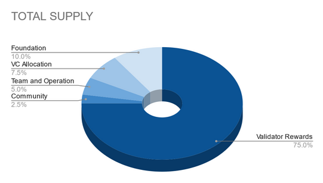

## Abstract

This document suggests reallocating the held reserve back to the treasury account, incorporating a reserve 
fund into the block rewards system, and revising the coin allocation to better benefit the community.

## Motivation

Pactus is currently responsible for holding the reserve funds for the project. However, due to limitations 
within Pactus core functionality and the absence of smart contracts, we are unable to establish an effective
time-locking or vesting schedule. As a result, the coins in these reserves are treated as unlocked, which 
could raise concerns about their potential negative impact on both the project and its investors if they 
were to be introduced to the market. By adopting this proposal, we can gradually release the reserve funds
into the supply, thereby empowering the community and reinforcing trust among our investors.

## Specification

Several actions need to take place for the implementation of this PIP.

  1. Reallocation of reserve funds back to the treasury account.
  2. Revisal of block rewards and recipients.
  3. Coin allocation revisal.
     

### Reserve Wallets

The team currently holds 4 reserve and 2 hot wallets, they are described below with balances.

#### Reserve:
  1. Foundation - Address - pc1z2r0fmu8sg2ffa0tgrr08gnefcxl2kq7wvquf8z - Balance = 8,400,000.194910010
  2. VC Funds - Address - pc1zprhnvcsy3pthekdcu28cw8muw4f432hkwgfasv - Balance = 6,300,000.000010001
  3. Team & Operations - Address - pc1znn2qxsugfrt7j4608zvtnxf8dnz8skrxguyf45 - Balance = 3,779,999.999010000
  4. Community - Address - pc1zs64vdggjcshumjwzaskhfn0j9gfpkvche3kxd3 - Balance = 1,889,999.999010000

_The complete balance of the reserve wallets should be transferred to the treasury account._

#### Hot Wallets: (Recieved 640,000 from reserve.)
  1. Team & Operations - Address - pc1zuavu4sjcxcx9zsl8rlwwx0amnl94sp0el3u37g - Balance 155,999.857000000
  2. Community - Address - pc1zf0gyc4kxlfsvu64pheqzmk8r9eyzxqvxlk6s6t - Balance 5998.971900000

_The complete balance of the hot wallets should remain in teams custody for immediate operational funds._

### Validator Considerations

This proposal should not affect validators in any way, they will continue to receive 1 coin per block as a reward.

### Block Rewards 

Block rewards are to increase from 1 coin per block to a rate 1.25 coins per block. 1 coin to be sent to the block proposer
and the remaining 0.25 to be divided among the reserve wallets.

### Block Rewards Allocation

Block rewards of 1.25 are to be allocated as below:

Proposer = 1

Foundation = 0.1

VC Funds = 0.075

Team & Operation = 0.05

Community = 0.025

### Coin Allocation Revision

The revision to the coin allocation are to be as follows:

Validators = 31,500,500

Foundation = 4,200,000

VC Allocation = 3,150,000

Team & Operations = 2,100,000 (420,000 already recieved to hot wallet 1) (1,680,000 remains from treasury)

Community = 1,050,000 (210,000 already recieved to hot wallet 2) (840,000 remains from treasury)

_Changes will not be made to the total supply, only the allocation._

## Backwards Compatibility

No backward compatibility issues found.

