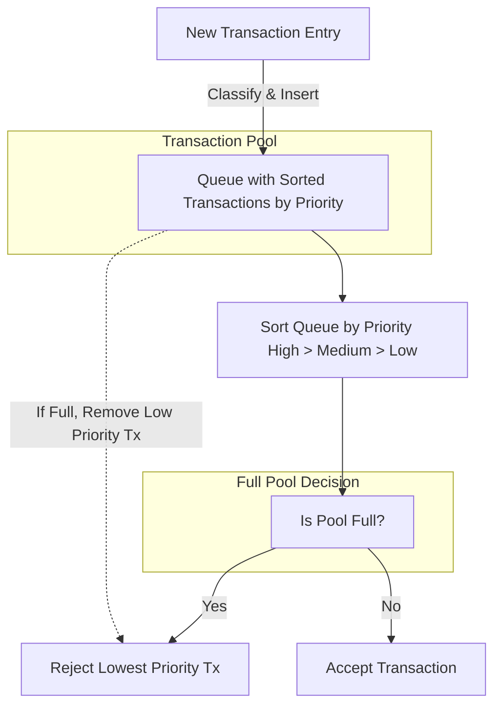

## Abstract

This proposal aims to implement a fee-based prioritization system in the transaction pool, ensuring transactions
with higher fees are prioritized. When the pool reaches capacity, lower-fee transactions will be deprioritized or
removed, optimizing network efficiency and incentivizing higher fees.

## Motivation

In our current transaction pool model, transactions are processed in a basic queue without prioritizing fees.
This approach allows zero or low-fee transactions to take up space, potentially delaying higher-fee transactions,
especially when the pool is full. As network usage increases, this lack of prioritization may lead to congestion
and limit throughput. By introducing a fee-based prioritization system, we can ensure that transactions with higher
fees are processed first, encouraging users to pay competitive fees for faster processing and enhancing the overall
efficiency and reliability of the network.

## Specification

The current blockchain transaction pool maintains a queue that handles incoming transactions without prioritization
based on fees. To improve network efficiency and optimize resource utilization, this specification introduces a prioritized
transaction handling system. Transactions are sorted within a single queue based on their fee levels: high, medium, and
low. If the transaction pool reaches its maximum capacity, the system will reject the lowest-priority transactions to
make room for higher-priority ones.

1. **New Transaction Entry (`P`)**:
   - The starting point where new transactions arrive and are classified based on their fee
   level (high, medium, or low).

2. **Transaction Pool (`Q`)**:
   - A single queue structure that holds all transactions. The transactions are maintained in a
   sorted order based on their fee levels, from highest to lowest priority (High > Medium > Low).

3. **Classify & Insert Operation**:
   - When a new transaction (`P`) arrives, it is classified by its fee level and inserted into
   the correct position within the queue (`Q`).

4. **Sort Queue by Priority (`S`)**:
   - The queue automatically re-sorts itself when a new transaction is added to ensure the highest-priority
   transactions are at the front and lower-priority ones are at the end.

5. **Full Pool Decision (`F`)**:
   - A decision point that checks if the transaction pool (`Q`) has reached its maximum capacity.

6. **Outcome When the Pool is Full**:
   - If the pool is full (`F` → `Yes`), the lowest-priority transaction is identified and rejected (`R`).
   - If the pool is not full (`F` → `No`), the new transaction is accepted into the pool (`A`).

7. **Rejection Process (`R`)**:
   - If the pool reaches capacity, this step involves removing the lowest-priority transaction
   (e.g., low or zero-fee) to make space for higher-priority transactions.

8. **Dashed Line (`Q` → `R`)**:
   - Indicates that, when the pool is full, the queue initiates a process to remove the lowest-priority
   transaction to maintain space for higher-priority transactions.

A **new transaction** enters the pool and is **classified** based on its fee level (high, medium, low).
The **queue (`Q`)** receives the transaction, and a **sort operation (`S`)** is triggered to reorder transactions by priority.
The system checks if the **pool is full** (`F`). If it is, the **lowest-priority transaction is rejected** (`R`), making
room for the new entry if needed.
If the pool is **not full**, the **new transaction is accepted** (`A`).

This diagram visually represents how the transaction pool prioritizes and handles new transactions, ensuring that
high-priority transactions are processed preferentially and that lower-priority transactions may be rejected when
space is limited.
