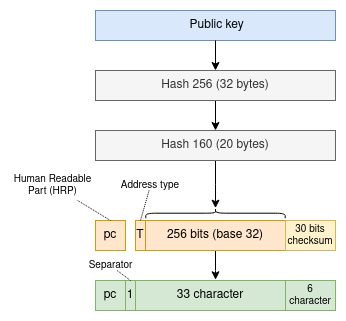
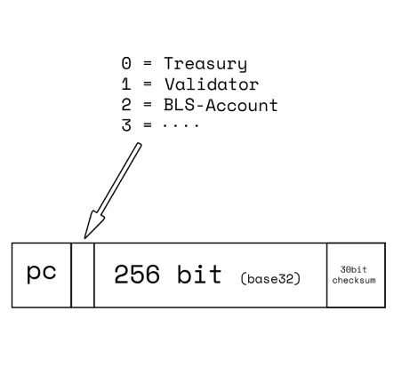

## Abstract

This proposal suggests adding address usage information to address types in Pactus, such as `validator` and `account`, to make their roles more understandable.
With this approach addresses can communicate their usage.

## Motivation

Currently, Pactus address types only indicate encryption, regardless of their usage. This makes it difficult for both humans and machines to identify the role of each address, whether it belongs to an `account`, `validator`, or `contract`.

By adding appropriate usage to the address type, we can quickly and easily identify the purpose of each address. For example:

## Specification

To achieve this, we propose defining `4` address types (for now): `0` for Treasury, `1` for `BLS-Accounts`, `2` for `BLS-Validator`, and `3` for `BLS-Contracts`. All addresses must have the correct type to be considered valid in Pactus. Additionally, we should consider creating new types for each new usage or encryption.

| type | name | example |
|----------|----------|----------|
| 0 | Treasury | 000000000000000000000000000000000000000000 |
| 1 | BLS-Accounts |  pc1puc5zza3hnp2tcf6r5n8zz0mwcjhqlxtejnjkzv |
| 2 | BLS-Validator | pc2p8wqgmagsrzn0nr26weg6wekqtu2mc6uw72k04a |
| 3 | BLS-Contracts | pc3pdw5fda6r757q780xvtsxhfls24vekrfqmddqrs |

Furthermore, any possible future address types must follow the same rule and have their own type based on `usage` and encryption.
