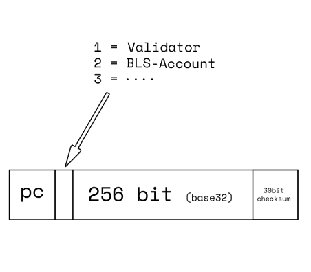

## Abstract

This proposal suggests adding Address usage in address types in Pactus, such as `validator` and `account`, to make their roles more understandable. 

## Motivation

Currently, Pactus addresses types are just show encryption, regardless of their usage. This makes it hard for both humans and machines to identify the role of each address, whether it belongs to an `account`, `validator`, or `contract`.

By adding appropriate usage to address type, we can quickly and easily identify the purpose of each address. For example:

## Specification

To achieve this, we can define `4` address type (for now): `0` for Treasury, `1` for `BLS-Accounts`, `2` for `BLS-Validator` and `3` for `BLS-Contracts`. All addresses must have the correct type to be considered valid in Pactus. Additionally, we must consider to have new types for each new usage or encryption.
 
- Account:   `pc1puc5zza3hnp2tcf6r5n8zz0mwcjhqlxtejnjkzv`
- Validator: `pc2p8wqgmagsrzn0nr26weg6wekqtu2mc6uw72k04a`
- Contract:  `pc3pdw5fda6r757q780xvtsxhfls24vekrfqmddqrs`

Furthermore, any possible future address types must follow the same rule and have their own type base on `usage` and encryption.
